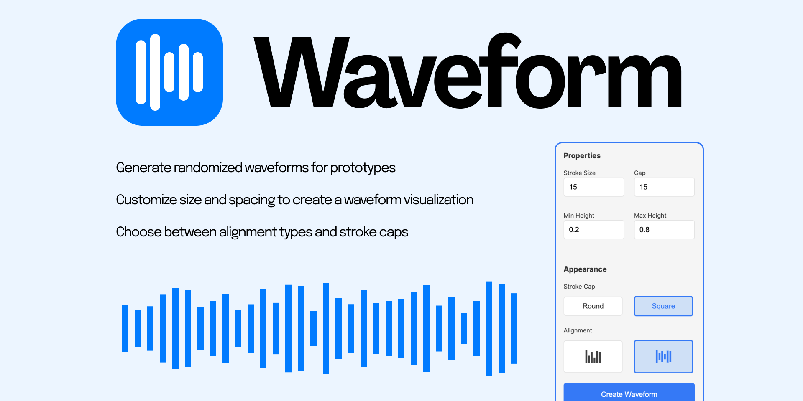
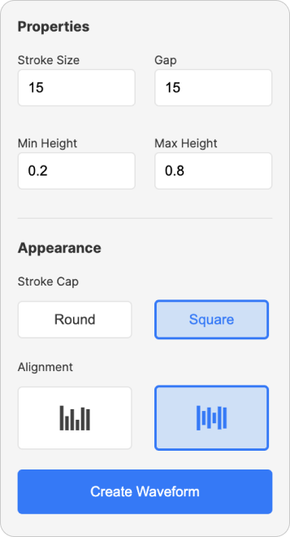

<h1>
Waveform
</h1>

Waveform is a Figma plugin to generate randomized waveform visualizations. 

<h2>Interface</h2>

<h3>Properties</h3>

<b>Stroke Size :</b> Changes the size of each indiviudual bar

<b>Gap :</b> Changes the space between each bar

<b>Min Height :</b> The minimum height of a bar. This number should be between 0 and 0.5 (Corresponds to the percentage of Frame Height)

<b>Max Height:</b> The maximum height of a bar. This number should be between 0.5 and 1 (Corresponds to the percentage of Frame Height)

<h3>Appearance</h3>

<b>Stroke Cap:</b> Sets the stroke cap to Round or Square based on the selection

<b>Alignment:</b> Aligns the waveform on the center or the baseline based on the selection

<h2>How to Use</h2>

Run the plugin and set the desired parameters. Select one or more frames and click on Create Waveform. Waveforms should populate in the selected frames. Clicking on the buttton lets you redo the generation. 

